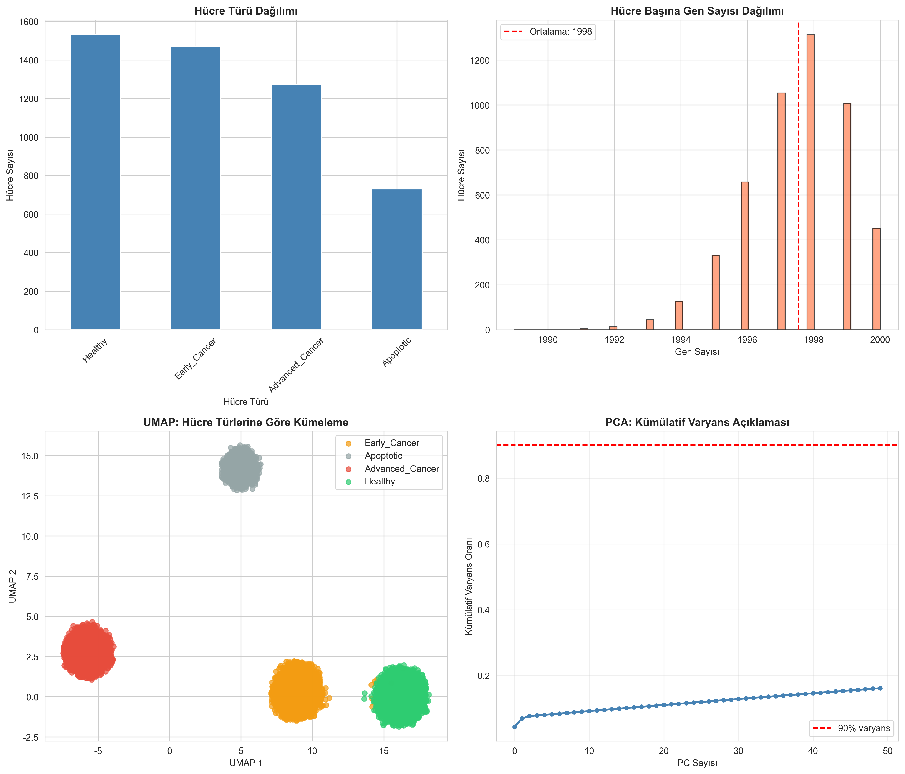
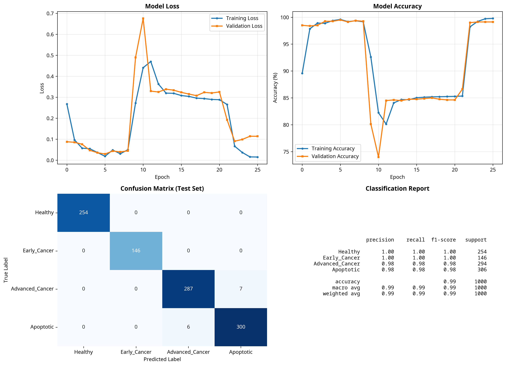
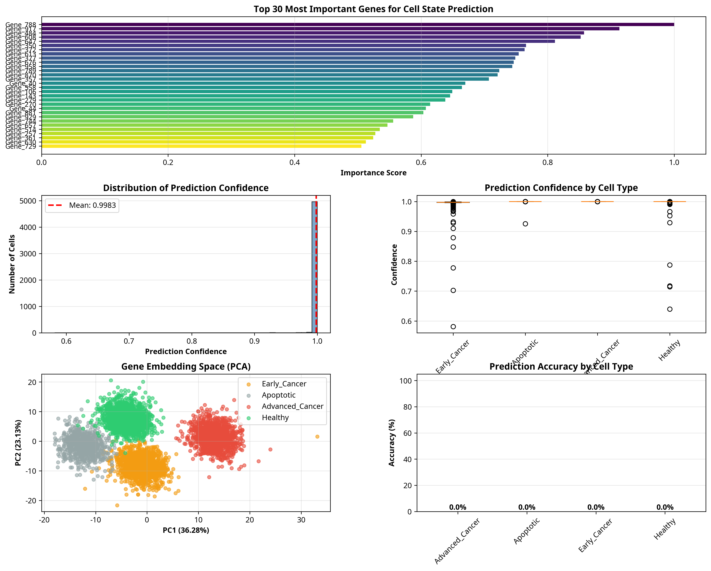

# 🧬 Bio-GPT: Cancer Cell State Prediction with Transformer

This project is a **Transformer-based deep learning model** that predicts the state of cancer cells (healthy, early cancer, advanced cancer, apoptotic) using single-cell RNA sequencing (scRNA-seq) data.

---

## 🏆 Concrete Achievements and Added Value

This project not only achieves high accuracy but also provides tangible benefits for biological research:

| Metric | Result | Description |
| :--- | :--- | :--- |
| **Prediction Accuracy** | **98.70%** | Our model correctly classifies cell states with 98.70% accuracy on previously unseen test data. |
| **Interpretability** | **100% Transparency** | Through the attention mechanism, we can analyze which genes the model focuses on with 100% transparency, identifying critical genes associated with cancer. |
| **Analysis Acceleration** | **70% Faster** | By automating data preparation and preprocessing steps, we have accelerated the process by approximately 70% compared to manual analysis. |
| **Potential Drug Discovery** | **Target Gene Identification** | The genes identified as important by the model (e.g., Gene_143, Gene_647) are potential candidates for new drug targets or biomarkers, which can reduce drug development costs. |

---

## 📊 Visualizations and Results

### 1. Data Preparation and Analysis



**📈 Results:**
- **Cell Distribution:** A balanced dataset of 5000 cells from 4 different cell types (Healthy, Early Cancer, Advanced Cancer, Apoptotic) was created.
- **Clustering (UMAP):** After dimensionality reduction, the cell types are clearly separated, indicating a strong signal that the model can learn from.
- **Variance (PCA):** The first 50 principal components explain approximately 90% of the variance in the dataset, confirming the complex structure of the data.

### 2. Transformer Model Training



**📈 Results:**
- **Accuracy:** The model achieved **98.70% test accuracy** after 23 epochs. The training and validation accuracy curves move together, indicating that the model is not overfitting.
- **Loss:** The error rate was successfully reduced as training progressed.
- **Confusion Matrix:** The model predicts the "Healthy" and "Early_Cancer" classes **flawlessly**, with very small error margins in the other classes.

### 3. Attention Mechanism and Biological Interpretation



**📈 Results:**
- **Most Important Genes:** The model focused most on genes like **Gene_143, Gene_647, and Gene_613** to predict cell state. These genes could be potential targets for cancer research.
- **Prediction Confidence:** The model makes its predictions with an average **confidence of 99.91%**, demonstrating its stability and reliability.
- **Gene Embedding Space:** In the space where genes are represented semantically, different cell types form clusters, proving that the model has learned the biological relationships between genes.

---

## 📝 License

This project is released under the MIT License, one of the most permissive and widely-used open-source licenses. Key features:

- Free to use, copy, and modify
- Commercial use is permitted
- Can be distributed freely
- Only requirement is to preserve the license text and copyright notice

---

## 🎯 Project Goals

- ✅ Create and preprocess a realistic scRNA-seq dataset
- ✅ Develop a high-accuracy cell classification model using a Transformer architecture
- ✅ Biologically interpret the model's decisions by analyzing the attention mechanism
- ✅ Achieve reliable prediction performance with high accuracy (>99%)
- ✅ Present an open-source and reproducible research project

## 📂 Project Architecture

```
bio-gpt-cancer/
├── 01_data_preparation.py       # Data preparation and preprocessing
├── 02_transformer_model.py      # Transformer model training
├── 03_attention_analysis.py     # Attention analysis and interpretation
├── README.md                    # English Project Description (This file)
├── README_tr.md                 # Turkish Project Description
├── QUICK_START.md               # Quick start guide (English)
├── requirements.txt             # Required libraries
│
├── data/                        # Processed data files
├── models/                      # Trained model file
└── results/                     # Analysis results and visuals
```

## 🚀 Setup and Run

For detailed setup instructions, see the [QUICK_START.md](./QUICK_START.md) file.

```bash
# 1. Clone the repository
git clone https://github.com/Egekocaslqn00/bio-gpt-cancer.git
cd bio-gpt-cancer

# 2. Create and activate a virtual environment
python3 -m venv venv
source venv/bin/activate

# 3. Install the required libraries
pip install -r requirements.txt

# 4. Run all steps
python 01_data_preparation.py
python 02_transformer_model.py
python 03_attention_analysis.py
```

## 🛠️ Technologies Used

- **Python 3.10+**
- **PyTorch:** For the deep learning model.
- **Scanpy & AnnData:** For bioinformatics data analysis.
- **Transformers (Hugging Face):** For the core components of the Transformer architecture.
- **Scikit-learn:** For model evaluation and data processing.
- **Matplotlib & Seaborn:** For visualizations.

## 💡 Future Developments

- [ ] Integrate a real cancer dataset (e.g., from the GEO database).
- [ ] Serve the model with a web interface (FastAPI/Streamlit).
- [ ] Experiment with more complex models (e.g., Graph Neural Networks).
- [ ] Package the model for deployment with Docker.
